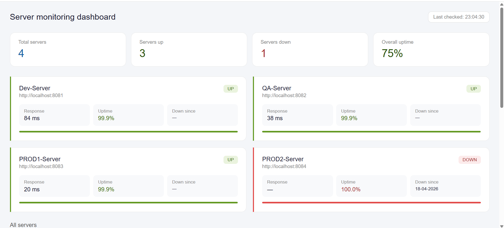
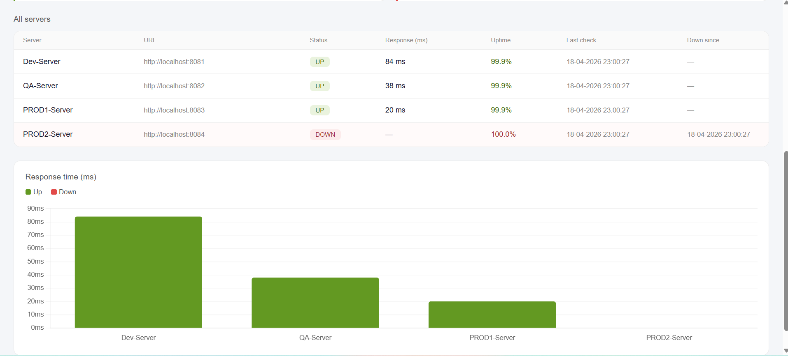
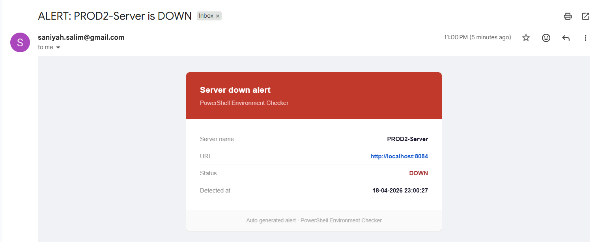
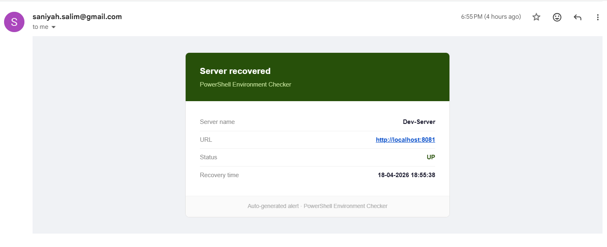
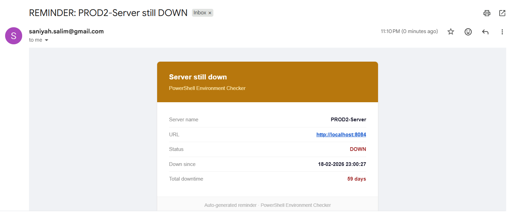

# PowerShell Environment Checker

A lightweight server monitoring tool built with PowerShell that automatically checks server health every 5 minutes, sends email alerts, and displays a live web dashboard.

---

## Preview

### Dashboard



### Server Table & Response Chart



### Email Alerts

| Server Down                                | Server Recovered                                     | Still Down Reminder                                |
| ------------------------------------------ | ---------------------------------------------------- | -------------------------------------------------- |
|  |  |  |

---

## Features

- **Automated monitoring** — runs every 5 minutes via Windows Task Scheduler
- **Email alerts** — instant notification when a server goes down
- **Daily reminders** — follow-up email if a server remains down for over 24 hours
- **Recovery alerts** — email notification when a server comes back up
- **Response time tracking** — measures and logs response time in milliseconds
- **Live web dashboard** — browser-based UI showing server status, uptime, and response times
- **CSV-based config** — easily add or remove servers by editing a CSV file
- **Persistent logging** — all check results saved to a local log file

---

## Project Structure

```
PowerShell-Environment-Checker/
├── Assets/                       # Screenshots for README
├── Config/
│   └── EnvCheckerList.csv        # List of servers to monitor
├── Dashboard/
│   ├── index.html                # Dashboard UI
│   ├── style.css                 # Dashboard styles
│   └── dashboard.js              # Dashboard logic
├── Scripts/
│   └── EnvironmentChecker.ps1    # Main monitoring script
├── Logs/                         # Auto-generated log files (gitignored)
├── .gitignore
├── LICENSE
└── README.md
```

---

## How It Works

1. The script reads server URLs from `Config/EnvCheckerList.csv`
2. It sends an HTTP request to each server and records the response
3. Status and response time are saved to `Logs/serverlog.txt`
4. Server data is written to `Dashboard/servers.json` for the dashboard to read
5. The dashboard auto-refreshes every 30 seconds
6. Email alerts are sent via Gmail SMTP on status changes

---

## Setup

### 1. Clone the repository

```bash
git clone https://github.com/SaniyahSalim/PowerShell-Environment-Checker.git
```

### 2. Add your servers

Edit `Config/EnvCheckerList.csv` and add your servers in this format:

```
ServerName,Url,LastStatus,ResponseTime,LastCheckTime,DownSince,LastDownAlertTime
My Server,https://example.com,,,,,
```

### 3. Set up Gmail credentials

Generate a Gmail App Password from your Google account and save it:

```powershell
$Credential = Get-Credential
$Credential | Export-Clixml "Credentials\gmail_cred.xml"
```

### 4. Update file paths

Open `Scripts/EnvironmentChecker.ps1` and update the paths at the top to match your local setup.

### 5. Run the script manually to test

```powershell
.\Scripts\EnvironmentChecker.ps1
```

### 6. Schedule with Task Scheduler

- Open **Windows Task Scheduler**
- Create a new task set to repeat every **5 minutes**
- Action: run `powershell.exe` with argument `-File "path\to\EnvironmentChecker.ps1"`

---

## Dashboard

Open `Dashboard/index.html` in your browser to view the live dashboard. It auto-refreshes every 30 seconds and shows:

- Total servers, servers up/down, overall uptime
- Per-server cards with status, response time, and uptime bar
- Full server table with last check time and downtime duration
- Bar chart of response times across all servers

---

## Email Alerts

| Trigger                     | Subject                             |
| --------------------------- | ----------------------------------- |
| Server goes down            | `ALERT: <ServerName> is DOWN`       |
| Server still down after 24h | `REMINDER: <ServerName> still DOWN` |
| Server recovers             | `RESOLVED: <ServerName> is UP`      |

---

## Tech Stack

- **PowerShell** — monitoring logic and email alerts
- **Windows Task Scheduler** — automated scheduling every 5 minutes
- **HTML / CSS / JavaScript** — web dashboard
- **Chart.js** — response time bar chart
- **Gmail SMTP** — email notifications

---

## Author

**Saniyah Salim**  
[GitHub](https://github.com/SaniyahSalim) · [LinkedIn](https://www.linkedin.com/in/saniyah-salim)

---

## License

This project is licensed under the MIT License.
